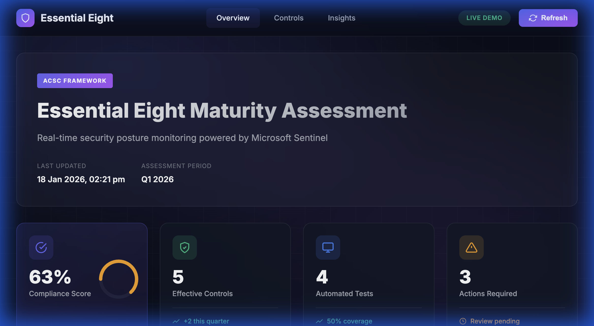
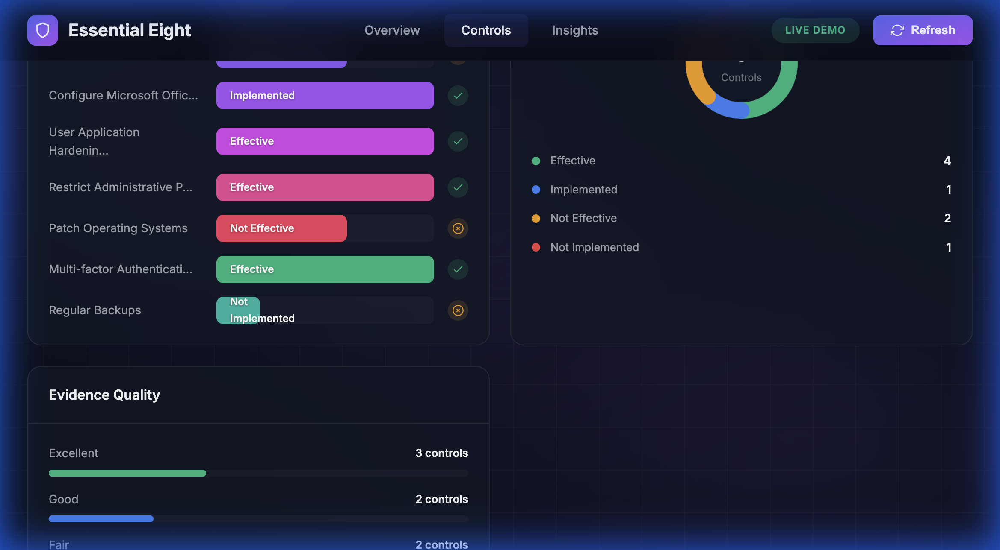
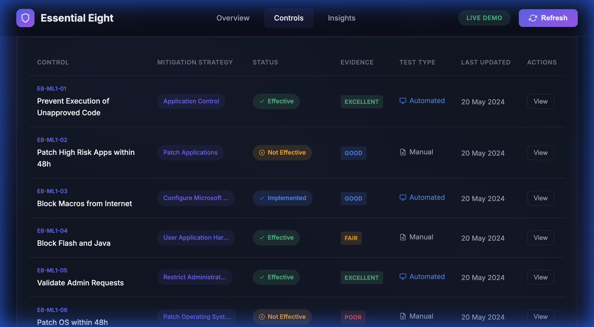
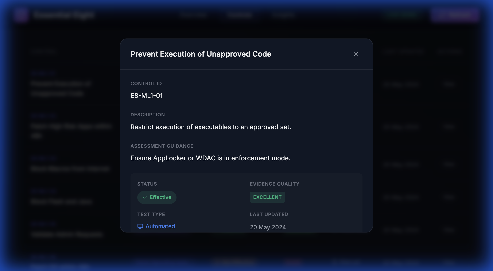

# Essential Eight Dashboard Demo

A beautiful, interactive HTML dashboard that showcases the ACSC Essential Eight security maturity assessment framework. Built for customer demonstrations - works immediately and can be hosted anywhere.



## Features

### 📊 Real-time KPI Cards
- **Compliance Score** - Visual circular progress indicator
- **Effective Controls** - Count with trend indicator
- **Automated Tests** - Coverage percentage
- **Actions Required** - Pending items count

### 📈 Interactive Visualizations
- **Strategy Overview Chart** - Horizontal bars showing each mitigation strategy status
- **Implementation Status Donut** - Breakdown of Effective, Implemented, Not Effective, Not Implemented
- **Evidence Quality Bars** - Distribution of Excellent, Good, Fair, Poor evidence



### 📋 Controls Assessment Table
- Filterable by status and test type
- Searchable by control name or ID
- Click "View" for detailed modal with:
  - Control description
  - Assessment guidance
  - Justification
  - Assessor details



### 💡 Insights & Recommendations
- Critical, Warning, and Success insights
- Actionable recommendations based on assessment data

## Getting Started

### Run Locally

1. Navigate to the demo-site folder:
   ```bash
   cd /Users/laroy/Project/Essential8/demo-site
   ```

2. Start a local web server:
   ```bash
   python3 -m http.server 8080
   ```

3. Open your browser to: [http://localhost:8080](http://localhost:8080)

### Hosting Options

This is a static site (HTML/CSS/JS only) - you can host it anywhere:

| Platform | How to Deploy |
|----------|--------------|
| **GitHub Pages** | Push to a GitHub repo and enable Pages in settings |
| **Netlify** | Drag & drop the `demo-site` folder |
| **Vercel** | Connect repo or use CLI `vercel deploy` |
| **Azure Static Web Apps** | Deploy via Azure Portal or VS Code extension |
| **AWS S3** | Upload files and enable static website hosting |
| **Any web server** | Copy files to your web root |

## File Structure

```
demo-site/
├── index.html      # Main HTML structure
├── styles.css      # Modern dark theme with glassmorphism
├── app.js          # Interactive data and charts
├── screenshots/    # Demo screenshots
└── README.md       # This file
```

## Customizing Data

Edit the `dashboardData` object in `app.js` to use your own control assessments:

```javascript
const dashboardData = {
    controls: [
        {
            id: "E8-ML1-01",
            strategy: "Application Control",
            title: "Your Control Title",
            description: "Control description...",
            status: "Effective",  // Effective, Implemented, Not Effective, Not Implemented
            evidence: "Excellent", // Excellent, Good, Fair, Poor
            testType: "Automated", // Automated, Manual
            // ... other fields
        }
    ]
};
```

## Design Features

- ✨ **Dark Theme** - Modern cybersecurity aesthetic
- 🌈 **Gradient Accents** - Purple/indigo accent colors
- 🔮 **Glassmorphism** - Frosted glass card effects
- 🎬 **Smooth Animations** - Fade-in, progress animations
- 📱 **Responsive** - Works on desktop and mobile
- ♿ **Accessible** - Semantic HTML, keyboard navigation

## Control Details Modal

Clicking "View" opens a detailed modal:



## License

This is a demo project for CloudSecOps customer presentations.
